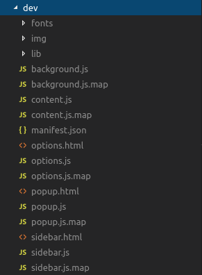
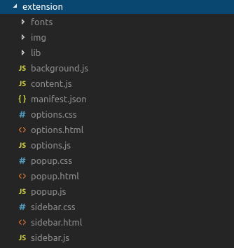
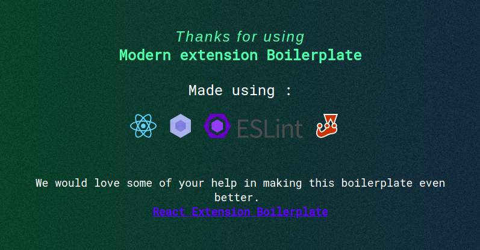

# React Extension Boilerplate for Chrome and Firefox

[ ](https://github.com/kryptokinght/react-extension-boilerplate/network/members)
[ ](https://github.com/kryptokinght/react-extension-boilerplate/issues)
[ ](https://github.com/kryptokinght/react-extension-boilerplate/stargazers)
[ ](https://github.com/kryptokinght/react-extension-boilerplate/watchers)
[](LICENSE)
[](https://github.com/kryptokinght/react-extension-boilerplate/pulls)

<em>
  
  :zap: Are you trying to create a **web Extension** but still looking for a starting point? <br/>
  :zap: Do you want your extension to run in both Firefox and Chrome? <br/>
  :zap: Are you tired of repeteadly reloading your extension after every small change you make? <br/>
  :zap: Do you want to develop your exetension using modern technologies like **React, Webpack, Jest**? <br/>

</em>

<br/>

***We have a solution!***

React Extension Boilerplate is a modern web extension template for building 
Mozilla and Chrome extensions using ReactJS.

Allows smooth and fast development of extension using on-the-go loading, building, packaging and publishing on the most common browsers Chrome and Firefox.<br/>
Make changes to the source code and watch the extension implement these changes live in the browser.
<br/> 
Implements all the best Javascript practises with ESLint, Jest, React-StoryBook, Webpack and lots more. 

* Source: [https://github.com/kryptokinght/react-extension-boilerplate](https://github.com/kryptokinght/react-extension-boilerplate)


## Installation :checkered_flag:

Installing this boilerplate is as simple as cloning this repo in a new folder and start editing the source folder.

```bash
# clone the git repo
$ git clone https://github.com/kryptokinght/react-extension-boilerplate.git

# Install dependencies
$ npm install
```

## Development :computer:

* Run script
```bash
# build files to './dev' 
# and launches the web ext in a new chrome instance, watches for changes and updates
$ npm run start:chrome
# launches in firefox
$ npm run start:mozilla
# runs storybook
$ npm run storybook
```
*`npm run chrome-launch` in action:*


* If you want to load your unpacked extension by yourself, then run `npm run dev`. This will create the extension inside an **dev** folder in `development` mode and will watch the `src` folder for changes.   
* [Load unpacked extensions](https://developer.chrome.com/extensions/getstarted#unpacked) with `./dev` folder. Though you have to reload the extension by yourself every time the `./dev` folder updates.

*Screenshot of the development folder:*
<br/>


**Go to the project folder and run the following commands:** 

## Build :wrench: :hammer:

```bash
# build files to './extension'
$ npm run build
```
*Once created here's what the extension folder looks like:*
<br/>



## Compress :nut_and_bolt: 

```bash
# compress build folder to {manifest.name}.zip and crx
$ npm run build
$ npm run compress -- [options]
```

#### Options

If you want to build `crx` file (auto update), please provide options, and add `update.xml` file url in [manifest.json](https://developer.chrome.com/extensions/autoupdate#update_url manifest.json).

* --app-id: your extension id (can be get it when you first release extension)
* --key: your private key path (default: './key.pem')  
  you can use `npm run compress-keygen` to generate private key `./key.pem`
* --codebase: your `crx` file url

See [autoupdate guide](https://developer.chrome.com/extensions/autoupdate) for more information.

## Features

## Contributing :tada:

To get an idea about the structure of the project, [read here](CODETOUR.md).
Contributions are highly welcome. Please take some time to read the guidelines mentioned here [contribute](CONTRIBUTING.md).

<div align="center">
  
</div>

## License

The code is available under the [MIT license](LICENSE).
